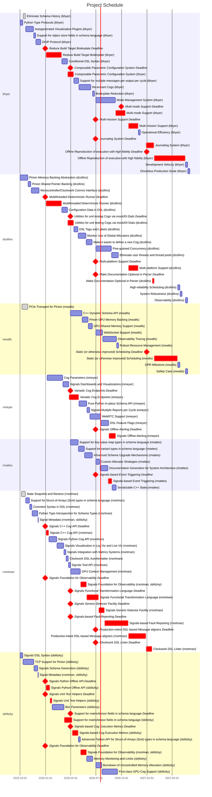

```mermaid
gantt
    title Project Schedule
    dateFormat YYYY-MM-DD
    tickInterval 3month
    todayMarker 2025-10-01

    section bhyer
    Eliminate Schema History (bhyer) :done, eliminate_schema_history, 2025-10-13, 7d
    Python Type Protocols (bhyer) :python_type_protocols, 2025-10-01, 10d
    Autogenerated Visualization Plugins (bhyer) :autogenerated_viz_plugins, 2025-10-21, 28d
    Support for object store fields in schema language (bhyer) :schema_object_store, 2025-11-19, 7d
    DOIP Protocol (bhyer) :protocol_doip, 2025-11-27, 17d
    Reduce Build Target Boilerplate Deadline :milestone, crit, reduce_build_target_boilerplate_deadline, 2025-12-31, 0d
    Reduce Build Target Boilerplate (bhyer) :crit, reduce_build_target_boilerplate, 2026-01-02, 56d
    Conditional DSL Syntax (bhyer) :conditional_dsl_syntax, 2026-02-28, 21d
    Composable Parametric Configuration System Deadline :milestone, crit, composable_config_deadline, 2026-03-31, 0d
    Composable Parametric Configuration System (bhyer) :crit, composable_config, 2026-03-22, 21d
    Support for multiple messages per output per cycle (bhyer) :multiple_messages_per_output_support, 2026-04-13, 17d
    Re-entrant Cogs (bhyer) :reentrant_cogs, 2026-05-01, 42d
    Boilerplate Reduction (bhyer) :boilerplate_reduction, 2026-06-19, 7d
    Mode Management System (bhyer) :mode_management, 2026-07-01, 70d
    Multi-mode Support Deadline :milestone, crit, multimode_support_deadline, 2026-09-30, 0d
    Multi-mode Support (bhyer) :crit, multimode_support, 2026-09-10, 35d
    Multi-mission Support Deadline :milestone, crit, multimission_support_deadline, 2026-06-30, 0d
    Multi-mission Support (bhyer) :crit, multimission_support, 2026-10-26, 35d
    Operational Efficiency (bhyer) :operational_efficiency, 2026-12-01, 7d
    Journaling System Deadline :milestone, crit, journaling_deadline, 2026-06-30, 0d
    Journaling System (bhyer) :crit, journaling, 2026-12-29, 28d
    Offline Reproduction of execution with high fidelity Deadline :milestone, crit, offline_reproduction_deadline, 2026-12-31, 0d
    Offline Reproduction of execution with high fidelity (bhyer) :crit, offline_reproduction, 2027-01-27, 112d
    Development Velocity (bhyer) :development_velocity, 2027-05-20, 7d
    Driverless Production Scale (bhyer) :driverless_production_scale, 2027-05-28, 7d
    section dcollins
    Pinion Memory Backing Abstraction (dcollins) :pinion_backing_abstraction, 2025-10-01, 28d
    Pinion Shared Pointer Backing (dcollins) :pinion_shared_ptr_backing, 2025-10-30, 10d
    Microcontroller/Clockwork Comms Interface (dcollins) :microcontroller_comms, 2025-11-10, 28d
    Multithreaded Deterministic Runner Deadline :milestone, crit, multithreaded_deterministic_runner_deadline, 2025-12-31, 0d
    Multithreaded Deterministic Runner (dcollins) :crit, multithreaded_deterministic_runner, 2026-01-02, 56d
    Configuration Data in DSL (dcollins) :config_data_in_dsl, 2026-02-28, 21d
    Utilities for unit testing Cogs via mock/DI Dials Deadline :milestone, crit, unit_test_dials_deadline, 2026-03-31, 0d
    Utilities for unit testing Cogs via mock/DI Dials (dcollins) :crit, unit_test_dials, 2026-03-22, 21d
    DSL Tags and Labels (dcollins) :dsl_tags_labels, 2026-04-13, 14d
    Monitor Use of Global Allocators (dcollins) :monitor_use_of_global_allocators, 2026-04-28, 28d
    Make it easier to define a new Cog (dcollins) :user_request_make_it_easier_to_define_a_new_cog, 2026-05-27, 21d
    Fine-grained Concurrency (dcollins) :fine_grained_concurrency, 2026-07-01, 56d
    Eliminate user threads and thread pools (dcollins) :eliminate_user_threads_and_thread_pools, 2026-08-27, 24d
    Multi-platform Support Deadline :milestone, crit, multiplatform_support_deadline, 2026-06-30, 0d
    Multi-platform Support (dcollins) :crit, multiplatform_support, 2026-10-26, 35d
    Make Documentation Optional in Parser Deadline :milestone, crit, make_docs_optional_in_parser_deadline, 2026-06-30, 0d
    Make Documentation Optional in Parser (dcollins) :crit, make_docs_optional_in_parser, 2027-01-20, 7d
    High-reliability Scheduling (dcollins) :high_reliability_scheduling, 2027-04-22, 7d
    System Robustness (dcollins) :system_robustness, 2027-04-30, 7d
    Observability (dcollins) :observability, 2027-05-20, 7d
    section mwalls
    PCIe Transport for Pinion (mwalls) :done, pcie_transport, 2025-10-08, 21d
    C++ Dynamic Schema API (mwalls) :cpp_dynamic_schema_api, 2026-03-31, 42d
    Pinion GPU Memory Backing (mwalls) :pinion_gpu_backing, 2026-05-13, 21d
    GPU Shared Memory Support (mwalls) :gpu_shared_memory_support, 2026-06-04, 14d
    WebSocket Support (mwalls) :websocket_support, 2026-07-01, 24d
    Observability Tracing (mwalls) :observability_tracing, 2026-07-26, 49d
    Robust Resource Management (mwalls) :robust_resource_management, 2026-09-14, 7d
    Static (or otherwise improved) Scheduling Deadline :milestone, crit, static_scheduling_deadline, 2026-12-31, 0d
    Static (or otherwise improved) Scheduling (mwalls) :crit, static_scheduling, 2027-01-27, 84d
    DPR Milestone (mwalls) :milestone_dpr, 2027-04-22, 7d
    Safety Case (mwalls) :safety_case, 2027-05-20, 7d
    section nmeyer
    Cog Parameters (nmeyer) :cog_parameters, 2026-01-06, 56d
    Signals Dashboards and Visualizations (nmeyer) :signals_dashboards, 2026-03-04, 21d
    Variadic Cog Endpoints Deadline :milestone, crit, variadic_cog_endpoints_deadline, 2026-03-31, 0d
    Variadic Cog Endpoints (nmeyer) :crit, variadic_cog_endpoints, 2026-03-26, 35d
    Pure Python In-place Schema API (nmeyer) :python_in_place_schema_api, 2026-05-01, 28d
    Signals Multiple Reports per Cycle (nmeyer) :signals_multiple_reports_per_cycle, 2026-05-30, 10d
    WebRTC Support (nmeyer) :webrtc_support, 2026-06-10, 38d
    DSL Feature Flags (nmeyer) :dsl_feature_flags, 2026-07-19, 28d
    Signals Offline Alerting Deadline :milestone, crit, signals_offline_alerting_deadline, 2026-06-30, 0d
    Signals Offline Alerting (nmeyer) :crit, signals_offline_alerting, 2026-08-17, 24d
    section rmattes
    Support for key-value map types in schema language (rmattes) :schema_key_value_map_type, 2026-03-31, 28d
    Support for variant types in schema language (rmattes) :schema_variant_types, 2026-04-29, 21d
    Advanced Schema Upgrade Mechanisms (rmattes) :schema_advanced_upgrade, 2026-05-21, 28d
    Custom Allocator Strategies (rmattes) :custom_allocator_strategies, 2026-07-01, 14d
    Documentation Generation for System Architecture (rmattes) :doc_generation_sys_arch, 2026-07-16, 28d
    Signals-based Event Triggering Deadline :milestone, crit, signals_based_event_triggering_deadline, 2026-06-30, 0d
    Signals-based Event Triggering (rmattes) :crit, signals_based_event_triggering, 2026-08-14, 14d
    Serializable C++ State (rmattes) :state_cpp_hybrid, 2026-08-29, 14d
    section rnortman
    State Snapshot and Restore (rnortman) :done, state_snapshot, 2025-10-06, 14d
    Support for Struct-of-Arrays (SoA) types in schema language (rnortman) :schema_soa_type, 2025-10-21, 14d
    Comment Syntax in DSL (rnortman) :dsl_comment_syntax, 2025-11-05, 7d
    Python Type Introspection for Schema Types (rnortman) :python_type_introspection, 2025-11-13, 21d
    Signal Metadata (rnortman, sbilitzky) :signals_metadata, 2025-12-05, 1d
    Signals C++ Cog API Deadline :milestone, crit, signals_cpp_cog_api_deadline, 2025-12-31, 0d
    Signals C++ Cog API (rnortman) :crit, signals_cpp_cog_api, 2026-01-02, 10d
    Signals Python Cog API (rnortman) :signals_python_cog_api, 2026-01-13, 28d
    Signals Visualization in Log Viz and Live Viz (rnortman) :signals_visualization_support, 2026-02-11, 24d
    Signals Integration with Metrics Systems (rnortman) :signals_metrics_integration, 2026-03-08, 7d
    Clockwork DSL Autoformatter (rnortman) :dsl_autoformatter, 2026-03-16, 7d
    Signals Tool API (rnortman) :signals_tool_api, 2026-03-24, 7d
    GPU Context Management (rnortman) :gpu_context_management, 2026-04-01, 35d
    Signals Foundation for Observability Deadline :milestone, crit, observability_signals_foundation_deadline, 2025-12-31, 0d
    Signals Foundation for Observability (rnortman, sbilitzky) :crit, observability_signals_foundation, 2026-05-07, 21d
    Signals Functional Transformation Language Deadline :milestone, crit, signals_functional_transforms_deadline, 2026-03-31, 0d
    Signals Functional Transformation Language (rnortman) :crit, signals_functional_transforms, 2026-05-29, 42d
    Signals Generic Detector Facility Deadline :milestone, crit, signals_generic_detector_facility_deadline, 2026-03-31, 0d
    Signals Generic Detector Facility (rnortman) :crit, signals_generic_detector_facility, 2026-07-11, 21d
    Signals-based Fault Reporting Deadline :milestone, crit, signals_based_fault_reporting_deadline, 2026-03-31, 0d
    Signals-based Fault Reporting (rnortman) :crit, signals_based_fault_reporting, 2026-08-02, 84d
    Production-intent DSL-based Message aligners Deadline :milestone, crit, aligners_deadline, 2026-06-30, 0d
    Production-intent DSL-based Message aligners (rnortman) :crit, aligners, 2026-10-26, 63d
    Clockwork DSL Linter Deadline :milestone, crit, dsl_linter_deadline, 2026-06-30, 0d
    Clockwork DSL Linter (rnortman) :crit, dsl_linter, 2026-12-29, 21d
    section sbilitzky
    Signals DSL Syntax (sbilitzky) :signals_dsl_syntax, 2025-10-01, 10d
    TCP Support for Pinion (sbilitzky) :tcp_support, 2025-10-12, 38d
    Signals Schema Generation (sbilitzky) :signals_schema_generation, 2025-11-20, 14d
    Signal Metadata (rnortman, sbilitzky) :signals_metadata, 2025-12-05, 1d
    Signals Python Offline API Deadline :milestone, crit, signals_python_offline_api_deadline, 2025-12-31, 0d
    Signals Python Offline API (sbilitzky) :crit, signals_python_offline_api, 2026-01-02, 14d
    Signals Unit Test Helpers Deadline :milestone, crit, signals_unit_test_helpers_deadline, 2025-12-31, 0d
    Signals Unit Test Helpers (sbilitzky) :crit, signals_unit_test_helpers, 2026-01-17, 7d
    Box Parameters (sbilitzky) :box_parameters, 2026-01-25, 42d
    Support for matrix/tensor fields in schema language Deadline :milestone, crit, schema_matrix_support_deadline, 2026-03-31, 0d
    Support for matrix/tensor fields in schema language (sbilitzky) :crit, schema_matrix_support, 2026-03-09, 28d
    Signals-based Cog Execution Metrics Deadline :milestone, crit, signals_based_cog_execution_metrics_deadline, 2026-03-31, 0d
    Signals-based Cog Execution Metrics (sbilitzky) :crit, signals_based_cog_execution_metrics, 2026-04-07, 21d
    Advanced Python API for Struct-of-Arrays (SoA) types in schema language (sbilitzky) :schema_soa_adv_python_api, 2026-04-29, 7d
    Signals Foundation for Observability Deadline :milestone, crit, observability_signals_foundation_deadline, 2025-12-31, 0d
    Signals Foundation for Observability (rnortman, sbilitzky) :crit, observability_signals_foundation, 2026-05-07, 21d
    Memory Monitoring and Limits (sbilitzky) :cog_memory_monitoring, 2026-05-29, 21d
    Burndown of Uncontrolled Memory Allocation (sbilitzky) :burndown_uncontrolled_allocation, 2026-07-01, 21d
    First-class GPU Cog Support (sbilitzky) :gpu_cogs, 2026-07-23, 56d
```
