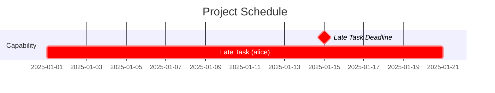
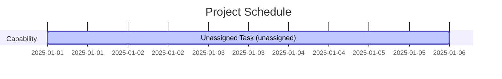

# Gantt Chart Scheduling

Mouc includes a resource-aware, deadline-driven scheduler that generates Mermaid Gantt charts from your feature map.

## Quick Start

```bash
# Generate a Gantt chart
mouc gantt --output schedule.md

# Set a project start date (important for historical scheduling)
mouc gantt --start-date 2025-01-01 --output q1-schedule.md

# Customize the chart title
mouc gantt --title "Q1 2025 Platform Roadmap" --output roadmap.md
```

The output is a Mermaid Gantt chart that can be rendered in Markdown viewers, GitHub, GitLab, and many documentation tools.

## Scheduling Metadata

Add scheduling information to entities using the `meta` field:

```yaml
entities:
  message_bus:
    type: capability
    name: Inter-Process Message Bus
    description: High-performance IPC system
    requires: [lock_free_queue]
    meta:
      effort: "3w"                    # Duration (see formats below)
      resources: ["alice", "bob"]     # People/teams assigned
      timeframe: "2025q1"             # Target timeframe (optional)
      start_after: "2025-01-15"       # Can't start before this date
      end_before: "2025-03-31"        # Hard deadline
```

### Metadata Fields

#### `effort` (required)
Work duration. Formats:
- `"5d"` - 5 days
- `"2w"` - 2 weeks (10 working days)
- `"1.5m"` - 1.5 months (30 working days)

Default: `"1w"` (1 week)

#### `resources` (optional)
List of people or teams assigned to the work. Affects scheduling:
- Multiple resources work in parallel (additive capacity)
- Same resource can't work on multiple tasks simultaneously
- Unassigned tasks are highlighted in blue (`:active` tag)

Formats:
```yaml
# Full-time allocation (default)
resources: ["alice"]

# Multiple resources (parallel work)
resources: ["alice", "bob"]  # 2x capacity

# Partial allocation
resources: ["alice:0.5"]     # Half-time
resources: ["alice:0.5", "bob:1.0"]  # Mixed allocation
```

Default: Empty list (task is unassigned)

#### `timeframe` (optional)
Target timeframe using flexible format. Acts as both `start_after` and `end_before` constraint if those aren't explicitly set.

Supported formats:
- **Quarters**: `"2025q1"`, `"2025Q4"` (Q1=Jan-Mar, Q2=Apr-Jun, Q3=Jul-Sep, Q4=Oct-Dec)
- **Weeks**: `"2025w01"`, `"2025W52"` (ISO week numbers, Monday-Sunday)
- **Halves**: `"2025h1"`, `"2025H2"` (H1=Jan-Jun, H2=Jul-Dec)
- **Years**: `"2025"` (full calendar year)
- **Months**: `"2025-01"`, `"2025-12"` (specific month)

Examples:
```yaml
meta:
  timeframe: "2025q1"     # Entire Q1 (Jan 1 - Mar 31)
  timeframe: "2025w05"    # Week 5 of 2025
  timeframe: "2025h2"     # Second half of 2025 (Jul 1 - Dec 31)
  timeframe: "2025-02"    # February 2025
```

**Note**: Explicit `start_after` and `end_before` always take precedence over `timeframe`.

#### `start_after` (optional)
Earliest date this task can start (ISO format: `YYYY-MM-DD`).

```yaml
start_after: "2025-02-01"  # Can't start before Feb 1
```

#### `end_before` (optional)
Hard deadline - task must complete by this date (ISO format: `YYYY-MM-DD`).

```yaml
end_before: "2025-03-31"   # Must finish by end of Q1
```

If a task can't meet its deadline, the scheduler:
1. Still schedules it (showing the reality)
2. Adds a warning to stderr
3. Marks the task with `:crit` (red) in the Gantt chart
4. Shows a deadline milestone marker (red diamond)

## Scheduling Algorithm

The scheduler uses a priority-based resource-constrained project scheduling (RCPSP) algorithm:

1. **Dependency resolution**: Validates no circular dependencies
2. **Deadline propagation**: Backward pass through dependency chains to compute latest allowed dates
3. **Priority calculation**: Combines deadline urgency and dependent count
4. **Forward scheduling**: Schedules tasks respecting:
   - Project start date
   - Dependency completion
   - Resource availability
   - Start/end constraints
   - Timeframe constraints

### Task Priority

Tasks are prioritized by:
1. **Deadline urgency**: Tasks with sooner deadlines scheduled first
2. **Impact**: Tasks with more dependents scheduled first
3. **Propagated deadlines**: If A depends on B and A has a deadline, B inherits an earlier deadline

This ensures critical-path work gets resources first.

### Resource Conflicts

When a resource is assigned to multiple tasks:
- Tasks serialize (one after another)
- Higher priority task goes first
- Tasks can overlap if using different resources

Example:
```yaml
task1:
  meta:
    effort: "1w"
    resources: ["alice"]

task2:
  requires: [task1]
  meta:
    effort: "1w"
    resources: ["alice"]  # Will start after task1 finishes

task3:
  requires: [task1]
  meta:
    effort: "1w"
    resources: ["bob"]    # Can run in parallel with task2
```

### Duration Calculation

Duration depends on effort and resource capacity:

```
duration_days = effort_days / total_capacity
```

Examples:
- Effort: 10d, Resources: ["alice"] → 10 days
- Effort: 10d, Resources: ["alice", "bob"] → 5 days (2x capacity)
- Effort: 10d, Resources: ["alice:0.5"] → 20 days (half capacity)
- Effort: 10d, Resources: ["alice:0.5", "bob:0.5"] → 10 days (1x total capacity)

## Visual Indicators

The Mermaid output uses visual tags to highlight important information:

### Late Tasks (`:crit`)
Tasks that miss their deadlines are marked with `:crit` (displayed in red):
- Shows a deadline milestone marker (red diamond) at the deadline date
- Task bar itself is highlighted in red
- Warning printed to stderr



### Unassigned Tasks (`:active`)
Tasks with no resources assigned are marked with `:active` (displayed in blue):
- Label shows "(unassigned)"
- All unassigned tasks share a single "unassigned" resource (they serialize)



**Note**: If a task is both late AND unassigned, `:crit` takes precedence (deadline violations are more important).

### Sections
Tasks are grouped by entity type:
- **Capability**: Technical work
- **User Story**: Customer requests
- **Outcome**: Business goals

## Examples

### Basic Example

```yaml
metadata:
  version: 1.0

entities:
  database:
    type: capability
    name: Database Setup
    description: PostgreSQL with replication
    meta:
      effort: "1w"
      resources: ["alice"]

  api:
    type: capability
    name: REST API
    description: Core API endpoints
    requires: [database]
    meta:
      effort: "2w"
      resources: ["bob"]

  auth_story:
    type: user_story
    name: User Authentication
    description: Login and session management
    requires: [api]
    meta:
      effort: "1w"
      resources: ["alice"]
      end_before: "2025-03-31"
```

Generated schedule (with `--start-date 2025-01-01`):
- Database: Jan 1 - Jan 5 (alice)
- REST API: Jan 6 - Jan 19 (bob, runs in parallel with database after it completes)
- User Authentication: Jan 20 - Jan 24 (alice, well before Mar 31 deadline)

### Resource Contention

```yaml
entities:
  task1:
    type: capability
    name: High Priority
    meta:
      effort: "1w"
      resources: ["alice"]
      end_before: "2025-01-15"  # Urgent deadline

  task2:
    type: capability
    name: Low Priority
    meta:
      effort: "1w"
      resources: ["alice"]
      end_before: "2025-12-31"  # Distant deadline
```

Result: task1 runs first (urgent deadline), task2 waits (same resource).

### Parallel Work

```yaml
entities:
  frontend:
    type: capability
    name: Frontend Components
    meta:
      effort: "2w"
      resources: ["alice", "bob"]  # 2x capacity = 1 week duration

  backend:
    type: capability
    name: Backend Services
    meta:
      effort: "2w"
      resources: ["charlie"]  # Runs in parallel
```

Result: Both finish in 1 week (frontend uses 2 people, backend uses 1).

### Timeframe Constraints

```yaml
entities:
  q1_feature:
    type: capability
    name: Q1 Delivery
    meta:
      effort: "3w"
      resources: ["alice"]
      timeframe: "2025q1"  # Must start and finish in Q1

  q2_feature:
    type: capability
    name: Q2 Planning
    requires: [q1_feature]
    meta:
      effort: "1w"
      resources: ["alice"]
      timeframe: "2025q2"  # Starts in Q2
```

Result: Q1 feature starts immediately, Q2 feature can't start before April 1.

## CLI Reference

```bash
mouc gantt [OPTIONS] [FILE]
```

### Arguments
- `FILE` - Path to feature map YAML (default: `feature_map.yaml`)

### Options
- `--start-date, -s DATE` - Project start date in `YYYY-MM-DD` format (default: today)
- `--title, -t TEXT` - Chart title (default: "Project Schedule")
- `--output, -o PATH` - Output file path
  - Files ending in `.md` are wrapped in ` ```mermaid ` code fences
  - Other files get raw Mermaid syntax

### Examples

```bash
# Basic usage
mouc gantt

# Custom start date and title
mouc gantt --start-date 2025-01-01 --title "Q1 Platform Roadmap"

# Output to markdown file (auto-wrapped in code fence)
mouc gantt --output schedule.md

# Output to .mmd file (raw Mermaid syntax)
mouc gantt --output schedule.mmd

# Different input file
mouc project.yaml gantt --output project-schedule.md
```

## Tips and Best Practices

### 1. Set a Project Start Date
Always use `--start-date` when generating charts for planning purposes. The default (today) causes past timeframes to be ignored.

```bash
mouc gantt --start-date 2025-01-01  # Good
mouc gantt                          # Uses today, may skip past work
```

### 2. Use Timeframes for Flexibility
Prefer `timeframe` over explicit dates when you want constraints to adjust automatically:

```yaml
# Flexible - adjusts to quarter boundaries
meta:
  timeframe: "2025q1"

# Rigid - exact dates
meta:
  start_after: "2025-01-01"
  end_before: "2025-03-31"
```

### 3. Assign Resources
Unassigned tasks are hard to schedule. Always specify who's doing the work:

```yaml
# Good
meta:
  resources: ["alice"]

# Avoid
meta:
  resources: []  # Unassigned!
```

### 4. Use Realistic Effort Estimates
The scheduler assumes work happens continuously during business days:
- 1 week = 5 days
- 1 month = 20 days

Account for interruptions, meetings, and context switching by padding estimates.

### 5. Review Deadline Warnings
Pay attention to stderr output - it shows which tasks can't meet their deadlines:

```bash
mouc gantt 2>&1 | grep Warning
# Warning: Entity 'api_gateway' finishes 5 days after required date (2025-04-05 vs 2025-03-31)
```

### 6. Leverage Deadline Propagation
Set deadlines on outcomes, they automatically propagate backward:

```yaml
mobile_launch:
  type: outcome
  name: Mobile App Launch
  requires: [auth_story]
  meta:
    end_before: "2025-06-30"  # Propagates urgency to auth_story
```

## Rendering Mermaid Charts

Mermaid charts can be rendered in many tools:

### GitHub/GitLab
Just commit the `.md` file - Mermaid renders automatically in the web UI.

### VS Code
Install the "Markdown Preview Mermaid Support" extension.

### Command Line
Use [mermaid-cli](https://github.com/mermaid-js/mermaid-cli):

```bash
npm install -g @mermaid-js/mermaid-cli
mouc gantt --output schedule.mmd
mmdc -i schedule.mmd -o schedule.png
```

### Online
Paste the Mermaid code into [Mermaid Live Editor](https://mermaid.live/).

## Limitations

1. **No resource leveling**: Scheduler doesn't optimize resource allocation, just respects conflicts
2. **No dependencies between milestones**: Mermaid doesn't support visual dependency arrows on Gantt charts
3. **Business days only**: No concept of weekends, holidays, or working hours
4. **No task splitting**: Tasks run continuously once started
5. **Simple resource model**: Resources are fungible (any "alice" allocation is equivalent)

## Future Enhancements

Potential future features:
- Custom fiscal year start dates (currently Jan 1)
- Resource calendars (vacation, holidays)
- Task splitting/preemption
- Cost tracking
- Critical path highlighting
- Slack/buffer analysis
- Export to other formats (MS Project, Excel)
