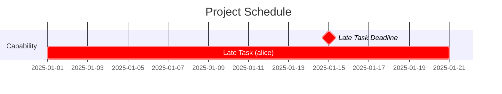
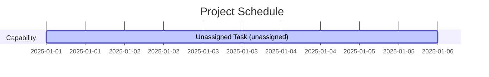

# Gantt Chart Scheduling

Mouc includes a resource-aware, deadline-driven scheduler that generates Mermaid Gantt charts from your feature map.

## Quick Start

```bash
# Generate a Gantt chart (tasks scheduled from today)
mouc gantt --output schedule.md

# Set both chart start and current date for historical planning
mouc gantt --start-date 2025-01-01 --current-date 2025-01-01 --output q1-schedule.md

# Show historical work (chart starts earlier, but schedule from today)
mouc gantt --start-date 2024-01-01 --current-date 2025-01-01 --output historical.md

# Customize the chart title
mouc gantt --title "Q1 2025 Platform Roadmap" --output roadmap.md

# Sort tasks by start date
mouc gantt --sort-by start --output sorted-schedule.md
```

The output is a Mermaid Gantt chart that can be rendered in Markdown viewers, GitHub, GitLab, and many documentation tools.

## Scheduling Metadata

Add scheduling information to entities using the `meta` field:

```yaml
entities:
  message_bus:
    type: capability
    name: Inter-Process Message Bus
    description: High-performance IPC system
    requires: [lock_free_queue]
    meta:
      effort: "3w"                    # Duration (see formats below)
      resources: ["alice", "bob"]     # People/teams assigned
      timeframe: "2025q1"             # Target timeframe (optional)
      start_after: "2025-01-15"       # Can't start before this date
      end_before: "2025-03-31"        # Hard deadline
```

### Metadata Fields

#### `start_date` and `end_date` (optional)
Fixed schedule dates that bypass the scheduler entirely. Use these when a task has predetermined dates that can't be changed.

```yaml
# Both dates specified - task runs exactly on these dates
start_date: "2025-02-01"
end_date: "2025-02-15"

# Only start_date - end_date computed from effort
start_date: "2025-02-01"
effort: "2w"  # Will end on 2025-02-15

# Only end_date - start_date computed from effort
end_date: "2025-02-15"
effort: "2w"  # Will start on 2025-02-01
```

**When to use fixed dates:**
- External deadlines (conferences, product launches)
- Work already in progress
- Contracted delivery dates
- Historical tracking of completed work

**Note:** Fixed-schedule tasks are NOT rescheduled based on dependencies or resource conflicts. Use `start_after` and `end_before` for flexible constraints instead.

#### `effort` (required)
Work duration. Formats:
- `"5d"` - 5 days
- `"2w"` - 2 weeks (10 working days)
- `"1.5m"` - 1.5 months (30 working days)

Default: `"1w"` (1 week)

#### `resources` (optional)
List of people or teams assigned to the work. Affects scheduling:
- Multiple resources work in parallel (additive capacity)
- Same resource can't work on multiple tasks simultaneously
- Unassigned tasks are highlighted in blue (`:active` tag)

Formats:
```yaml
# Full-time allocation (default)
resources: ["alice"]

# Multiple resources (parallel work)
resources: ["alice", "bob"]  # 2x capacity

# Partial allocation
resources: ["alice:0.5"]     # Half-time
resources: ["alice:0.5", "bob:1.0"]  # Mixed allocation
```

Default: Empty list (task is unassigned)

#### `timeframe` (optional)
Target timeframe using flexible format. Acts as both `start_after` and `end_before` constraint if those aren't explicitly set.

Supported formats:
- **Quarters**: `"2025q1"`, `"2025Q4"` (Q1=Jan-Mar, Q2=Apr-Jun, Q3=Jul-Sep, Q4=Oct-Dec)
- **Weeks**: `"2025w01"`, `"2025W52"` (ISO week numbers, Monday-Sunday)
- **Halves**: `"2025h1"`, `"2025H2"` (H1=Jan-Jun, H2=Jul-Dec)
- **Years**: `"2025"` (full calendar year)
- **Months**: `"2025-01"`, `"2025-12"` (specific month)

Examples:
```yaml
meta:
  timeframe: "2025q1"     # Entire Q1 (Jan 1 - Mar 31)
  timeframe: "2025w05"    # Week 5 of 2025
  timeframe: "2025h2"     # Second half of 2025 (Jul 1 - Dec 31)
  timeframe: "2025-02"    # February 2025
```

**Note**: Explicit `start_after` and `end_before` always take precedence over `timeframe`.

#### `start_after` (optional)
Earliest date this task can start (ISO format: `YYYY-MM-DD`).

```yaml
start_after: "2025-02-01"  # Can't start before Feb 1
```

#### `end_before` (optional)
Hard deadline - task must complete by this date (ISO format: `YYYY-MM-DD`).

```yaml
end_before: "2025-03-31"   # Must finish by end of Q1
```

If a task can't meet its deadline, the scheduler:
1. Still schedules it (showing the reality)
2. Adds a warning to stderr
3. Marks the task with `:crit` (red) in the Gantt chart
4. Shows a deadline milestone marker (red diamond)

## Dual Date System

Mouc uses separate dates for **visualization** (chart start) and **scheduling** (current date):

### Chart Start Date (`--start-date`)
Controls the left edge of the Gantt chart visualization.

**Default behavior**: Automatically calculated as the minimum of:
- The earliest fixed task `start_date`
- The current date

**Use cases**:
- Show historical work alongside future planning
- Create charts that span multiple quarters/years
- Display work that started before today

### Current Date (`--current-date`)
Controls the "as-of" date for scheduling decisions.

**Default behavior**: Today's date

**Use cases**:
- Planning "what if" scenarios ("what if we started today?")
- Historical analysis ("what would the schedule have looked like on Jan 1?")
- Preventing tasks from being scheduled in the past

### How Tasks Are Scheduled

1. **Tasks with fixed `start_date`/`end_date`**: Use exact dates (bypass scheduler)
2. **Tasks with `start_after`**: Start at `max(start_after, current_date)` (respects whichever is later)
3. **Tasks with `timeframe`**: Start at `max(timeframe_start, current_date)`
4. **Tasks with no constraints**: Start at `current_date` or when dependencies complete

**Key principle**: Tasks without explicit dates can't start before the current date (no scheduling in the past).

### Examples

#### Planning from today (default):
```bash
mouc gantt --output schedule.md
# Chart starts at earliest fixed task date or today
# New work scheduled from today
```

#### Historical planning:
```bash
mouc gantt --start-date 2024-01-01 --current-date 2025-01-01 --output history.md
# Chart shows work from 2024-01-01 onward
# New work scheduled from 2025-01-01 (not backdated to 2024)
```

#### Future planning:
```bash
mouc gantt --start-date 2025-06-01 --current-date 2025-06-01 --output q2-plan.md
# Both chart and scheduling start at Q2
```

### The Red "Today" Line

The vertical red line in Mermaid charts (the `todayMarker`) is positioned at the **current date**, not the chart start date. This makes it easy to see:
- What work is in progress
- What's completed vs. upcoming
- Whether you're on track with the current date

## Scheduling Algorithm

The scheduler uses a priority-based resource-constrained project scheduling (RCPSP) algorithm:

1. **Fixed-schedule tasks**: Process tasks with explicit `start_date`/`end_date` first (bypass scheduler)
2. **Dependency resolution**: Validates no circular dependencies
3. **Deadline propagation**: Backward pass through dependency chains to compute latest allowed dates
4. **Priority calculation**: Combines deadline urgency and dependent count (relative to current date)
5. **Forward scheduling**: Schedules tasks respecting:
   - Current date (baseline for all scheduling)
   - Dependency completion
   - Resource availability
   - Start/end constraints (`start_after`, `end_before`)
   - Timeframe constraints (with current date floor)

### Task Priority

Tasks are prioritized by:
1. **Deadline urgency**: Tasks with sooner deadlines scheduled first
2. **Impact**: Tasks with more dependents scheduled first
3. **Propagated deadlines**: If A depends on B and A has a deadline, B inherits an earlier deadline

This ensures critical-path work gets resources first.

### Resource Conflicts

When a resource is assigned to multiple tasks:
- Tasks serialize (one after another)
- Higher priority task goes first
- Tasks can overlap if using different resources

Example:
```yaml
task1:
  meta:
    effort: "1w"
    resources: ["alice"]

task2:
  requires: [task1]
  meta:
    effort: "1w"
    resources: ["alice"]  # Will start after task1 finishes

task3:
  requires: [task1]
  meta:
    effort: "1w"
    resources: ["bob"]    # Can run in parallel with task2
```

### Duration Calculation

Duration depends on effort and resource capacity:

```
duration_days = effort_days / total_capacity
```

Examples:
- Effort: 10d, Resources: ["alice"] → 10 days
- Effort: 10d, Resources: ["alice", "bob"] → 5 days (2x capacity)
- Effort: 10d, Resources: ["alice:0.5"] → 20 days (half capacity)
- Effort: 10d, Resources: ["alice:0.5", "bob:0.5"] → 10 days (1x total capacity)

## Visual Indicators

The Mermaid output uses visual tags to highlight important information:

### Late Tasks (`:crit`)
Tasks that miss their deadlines are marked with `:crit` (displayed in red):
- Shows a deadline milestone marker (red diamond) at the deadline date
- Task bar itself is highlighted in red
- Warning printed to stderr



### Unassigned Tasks (`:active`)
Tasks with no resources assigned are marked with `:active` (displayed in blue):
- Label shows "(unassigned)"
- All unassigned tasks share a single "unassigned" resource (they serialize)



**Note**: If a task is both late AND unassigned, `:crit` takes precedence (deadline violations are more important).

## Task Organization

Gantt charts can be organized using grouping and sorting configured in `mouc_config.yaml` or via custom styling functions.

### Default Behavior

By default, tasks appear in a single ungrouped list in YAML file order:

```bash
mouc gantt --output schedule.md
# No sections, tasks in YAML order
```

### Config-Driven Organization

Configure grouping and sorting in `mouc_config.yaml`:

```yaml
gantt:
  group_by: type  # or: resource, timeframe, none
  sort_by: start  # or: end, deadline, name, priority, yaml_order
  entity_type_order: [capability, user_story, outcome]  # for group_by: type
```

**Grouping Options** (`group_by`):
- `none` - No grouping, all tasks together (default)
- `type` - Group by entity type (capability, user story, outcome)
- `resource` - Group by assigned resource name
- `timeframe` - Group by timeframe metadata field

**Sorting Options** (`sort_by`):
- `yaml_order` - Preserve YAML file order (default)
- `start` - Sort by start date ascending
- `end` - Sort by end date ascending
- `deadline` - Sort by deadline (end_before or timeframe end)
- `name` - Sort alphabetically by entity name
- `priority` - Sort by priority metadata descending

**CLI Overrides**:
```bash
# Override grouping
mouc gantt --group-by type --output schedule.md

# Override sorting
mouc gantt --sort-by start --output schedule.md

# Override both
mouc gantt --group-by resource --sort-by priority --output schedule.md
```

### Group by Type Example

```yaml
gantt:
  group_by: type
```

Tasks are grouped into sections by entity type:
- **Capability**: Technical work
- **User Story**: Customer requests
- **Outcome**: Business goals

Useful for understanding work distribution across types.

### Group by Resource Example

```yaml
gantt:
  group_by: resource
```

Tasks are grouped by assigned resource (person/team):
- Each resource gets their own section
- Tasks with multiple resources appear in **each** section
- Resources sorted alphabetically
- Unassigned tasks in "unassigned" section at end

**Example:**
```yaml
entities:
  backend:
    type: capability
    name: Backend API
    meta:
      effort: "10d"
      resources: ["alice", "bob"]  # Appears in both sections

  frontend:
    type: capability
    name: Frontend UI
    meta:
      effort: "5d"
      resources: ["alice"]  # Only in alice's section
```

Generated chart has:
- `section alice` - Both "Backend API" and "Frontend UI"
- `section bob` - "Backend API" only

Useful for resource capacity planning and workload balancing.

### Custom Organization with Styling Functions

For advanced organization, write custom styling functions:

```python
# my_gantt_styles.py
from mouc.styling import group_tasks, sort_tasks

@group_tasks(formats=['gantt'])
def group_by_milestone(tasks, context):
    """Group tasks by milestone metadata."""
    groups = {}
    for task in tasks:
        entity = context.get_entity(task.entity_id)
        milestone = entity.meta.get('milestone', 'Backlog')
        if milestone not in groups:
            groups[milestone] = []
        groups[milestone].append(task)

    # Dict order controls section display order
    return dict(sorted(groups.items()))

@sort_tasks(formats=['gantt'])
def sort_critical_first(tasks, context):
    """Critical tasks first, then by start date."""
    def sort_key(task):
        entity = context.get_entity(task.entity_id)
        is_critical = entity.meta.get('priority', 0) > 80
        return (not is_critical, task.start_date)
    return sorted(tasks, key=sort_key)
```

```bash
mouc gantt --style-file my_gantt_styles.py --output schedule.md
```

**Key points**:
- Custom functions override config settings (higher priority)
- `group_tasks` returns dict mapping section names to task lists
- Dict insertion order controls section display order
- `sort_tasks` applies within each group
- Use `formats=['gantt']` to scope to gantt output only

See the [Styling documentation](styling.md) for more details on styling functions.

## Examples

### Basic Example

```yaml
metadata:
  version: 1.0

entities:
  database:
    type: capability
    name: Database Setup
    description: PostgreSQL with replication
    meta:
      effort: "1w"
      resources: ["alice"]

  api:
    type: capability
    name: REST API
    description: Core API endpoints
    requires: [database]
    meta:
      effort: "2w"
      resources: ["bob"]

  auth_story:
    type: user_story
    name: User Authentication
    description: Login and session management
    requires: [api]
    meta:
      effort: "1w"
      resources: ["alice"]
      end_before: "2025-03-31"
```

Generated schedule (with `--start-date 2025-01-01`):
- Database: Jan 1 - Jan 5 (alice)
- REST API: Jan 6 - Jan 19 (bob, runs in parallel with database after it completes)
- User Authentication: Jan 20 - Jan 24 (alice, well before Mar 31 deadline)

### Resource Contention

```yaml
entities:
  task1:
    type: capability
    name: High Priority
    meta:
      effort: "1w"
      resources: ["alice"]
      end_before: "2025-01-15"  # Urgent deadline

  task2:
    type: capability
    name: Low Priority
    meta:
      effort: "1w"
      resources: ["alice"]
      end_before: "2025-12-31"  # Distant deadline
```

Result: task1 runs first (urgent deadline), task2 waits (same resource).

### Parallel Work

```yaml
entities:
  frontend:
    type: capability
    name: Frontend Components
    meta:
      effort: "2w"
      resources: ["alice", "bob"]  # 2x capacity = 1 week duration

  backend:
    type: capability
    name: Backend Services
    meta:
      effort: "2w"
      resources: ["charlie"]  # Runs in parallel
```

Result: Both finish in 1 week (frontend uses 2 people, backend uses 1).

### Timeframe Constraints

```yaml
entities:
  q1_feature:
    type: capability
    name: Q1 Delivery
    meta:
      effort: "3w"
      resources: ["alice"]
      timeframe: "2025q1"  # Must start and finish in Q1

  q2_feature:
    type: capability
    name: Q2 Planning
    requires: [q1_feature]
    meta:
      effort: "1w"
      resources: ["alice"]
      timeframe: "2025q2"  # Starts in Q2
```

Result: Q1 feature starts immediately, Q2 feature can't start before April 1.

## CLI Reference

```bash
mouc gantt [OPTIONS] [FILE]
```

### Arguments
- `FILE` - Path to feature map YAML (default: `feature_map.yaml`)

### Options
- `--start-date, -s DATE` - Chart start date (left edge of visualization) in `YYYY-MM-DD` format.
  - Default: min(earliest fixed task date, current date)
- `--current-date, -c DATE` - Current/as-of date for scheduling in `YYYY-MM-DD` format.
  - Default: today
- `--title, -t TEXT` - Chart title (default: "Project Schedule")
- `--group-by GROUP` - How to group tasks: `none`, `type`, `resource`, or `timeframe`
  - Overrides `gantt.group_by` config setting
  - Default: `none` (no grouping)
- `--sort-by SORT` - How to sort tasks: `start`, `end`, `deadline`, `name`, `priority`, or `yaml_order`
  - Overrides `gantt.sort_by` config setting
  - Default: `yaml_order` (preserve YAML file order)
- `--markdown-base-url URL` - Base URL for clickable task links (e.g., `./feature_map.md` or `https://github.com/user/repo/blob/main/feature_map.md`)
  - Tasks become clickable and link to corresponding markdown headers
  - Can also be configured via `gantt.markdown_base_url` in `mouc_config.yaml`
- `--style-file PATH` - Python file with custom styling/organization functions
  - See [Styling documentation](styling.md) for details
- `--output, -o PATH` - Output file path
  - Files ending in `.md` are wrapped in ` ```mermaid ` code fences
  - Other files get raw Mermaid syntax

### Examples

```bash
# Basic usage (schedule from today)
mouc gantt

# Plan from specific date
mouc gantt --start-date 2025-01-01 --current-date 2025-01-01 --title "Q1 Platform Roadmap"

# Show historical work with current planning
mouc gantt --start-date 2024-01-01 --current-date 2025-01-01

# Output to markdown file (auto-wrapped in code fence)
mouc gantt --output schedule.md

# Output to .mmd file (raw Mermaid syntax)
mouc gantt --output schedule.mmd

# Group by entity type
mouc gantt --group-by type --output grouped-schedule.md

# Group by resource
mouc gantt --group-by resource --output by-resource.md

# Sort by start date
mouc gantt --sort-by start --output sorted-schedule.md

# Sort by priority
mouc gantt --sort-by priority --output priority-view.md

# Make tasks clickable with links to markdown doc
mouc gantt --markdown-base-url ./feature_map.md --output schedule.md

# Use custom organization functions
mouc gantt --style-file my_gantt_styles.py --output custom-view.md

# Different input file
mouc gantt project.yaml --output project-schedule.md
```

## Tips and Best Practices

### 1. Use Both Dates for Historical Planning
To see work that started in the past alongside current planning, set both dates:

```bash
# Show Q1 work alongside Q2 planning
mouc gantt --start-date 2025-01-01 --current-date 2025-04-01

# Just plan from today
mouc gantt  # Chart and scheduling both start at today
```

### 2. Choose the Right Date Fields

- **Fixed schedule** (`start_date`/`end_date`): Use for work with immovable dates
  - External deadlines, contracts, historical tracking
- **Flexible constraints** (`start_after`/`end_before`): Use for work that can adapt
  - "Can't start until X is ready", "Must finish by Y"
- **Timeframes** (`timeframe`): Use for quarter/month targets that respect current date
  - "Target Q1", "Aim for February"

### 3. Use Timeframes for Flexibility
Prefer `timeframe` over explicit dates when you want constraints to adjust automatically:

```yaml
# Flexible - adjusts to quarter boundaries and current date
meta:
  timeframe: "2025q1"

# Rigid - exact dates
meta:
  start_after: "2025-01-01"
  end_before: "2025-03-31"
```

### 4. Assign Resources
Unassigned tasks are hard to schedule. Always specify who's doing the work:

```yaml
# Good
meta:
  resources: ["alice"]

# Avoid
meta:
  resources: []  # Unassigned!
```

### 5. Use Realistic Effort Estimates
The scheduler assumes work happens continuously during business days:
- 1 week = 5 days
- 1 month = 20 days

Account for interruptions, meetings, and context switching by padding estimates.

### 6. Review Deadline Warnings
Pay attention to stderr output - it shows which tasks can't meet their deadlines:

```bash
mouc gantt 2>&1 | grep Warning
# Warning: Entity 'api_gateway' finishes 5 days after required date (2025-04-05 vs 2025-03-31)
```

### 7. Leverage Deadline Propagation
Set deadlines on outcomes, they automatically propagate backward:

```yaml
mobile_launch:
  type: outcome
  name: Mobile App Launch
  requires: [auth_story]
  meta:
    end_before: "2025-06-30"  # Propagates urgency to auth_story
```

### 8. Customize Task Appearance with Styling

Use the styling system to customize how tasks appear in the Gantt chart:

```bash
mouc gantt --style-file ./my_styles.py --output schedule.md
```

Create a Python file with task styling functions:

```python
from mouc.styling import style_task

@style_task
def color_by_priority(entity, context):
    """Style tasks based on priority using tags."""
    priority = entity.meta.get('priority')
    if priority == 'high':
        return {'tags': ['crit']}  # Red/critical
    elif priority == 'medium':
        return {'tags': ['active']}  # Blue
    return {}

@style_task(priority=20)
def color_by_team(entity, context):
    """Apply custom colors by team using CSS."""
    team = entity.meta.get('team')
    colors = {
        'platform': '#4287f5',
        'backend': '#42f554',
        'frontend': '#f54242'
    }
    if team in colors:
        return {'fill_color': colors[team]}
    return {}
```

Available Mermaid gantt tags (predefined colors):
- `done`: Completed tasks (green)
- `crit`: Critical tasks (red)
- `active`: In-progress tasks (blue)
- `milestone`: Milestone markers

Available CSS properties (custom colors):
- `fill_color`: Task bar fill color
- `stroke_color`: Task bar border color
- `text_color`: Task text color

See the [Styling documentation](styling.md#task-styling-gantt-charts) for more details.

## Rendering Mermaid Charts

Mermaid charts can be rendered in many tools:

### GitHub/GitLab
Just commit the `.md` file - Mermaid renders automatically in the web UI.

### VS Code
Install the "Markdown Preview Mermaid Support" extension.

### Command Line
Use [mermaid-cli](https://github.com/mermaid-js/mermaid-cli):

```bash
npm install -g @mermaid-js/mermaid-cli
mouc gantt --output schedule.mmd
mmdc -i schedule.mmd -o schedule.png
```

### Online
Paste the Mermaid code into [Mermaid Live Editor](https://mermaid.live/).

## Limitations

1. **No resource leveling**: Scheduler doesn't optimize resource allocation, just respects conflicts
2. **No dependencies between milestones**: Mermaid doesn't support visual dependency arrows on Gantt charts
3. **Business days only**: No concept of weekends, holidays, or working hours
4. **No task splitting**: Tasks run continuously once started
5. **Simple resource model**: Resources are fungible (any "alice" allocation is equivalent)

## Future Enhancements

Potential future features:
- Custom fiscal year start dates (currently Jan 1)
- Resource calendars (vacation, holidays)
- Task splitting/preemption
- Cost tracking
- Critical path highlighting
- Slack/buffer analysis
- Export to other formats (MS Project, Excel)
